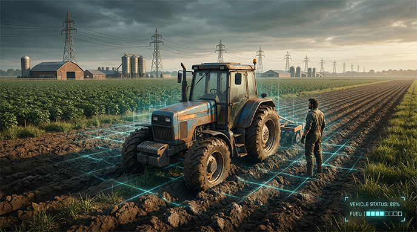

<!-- Keywords: Open-source farming simulator, Godot 4 farming engine, hardcore survival simulation, realistic agriculture simulator, systemic game design, UESS, data-driven farming, OpenAcre Project -->

# OpenAcre 
**A Hardcore, Open-Source Agricultural Life Simulator built in Godot 4.**

---

## 🌾 About the Project

**OpenAcre** (formerly *OpenFarm Survival*) is not your traditional, cozy farming game. Here, survival is the ultimate metric. We are building a deeply moddable, system-first engine where players must manage personal needs (hunger, energy), maintain complex machinery, and build functional infrastructure. If your tractor breaks down, your crops die. If your crops die, you starve. 

Our goal is to push the boundaries of open-source life simulation, seamlessly blending minute-to-minute manual labor with long-term infrastructure strategy.

### ✨ Key Features
* ⚙️ **System-Driven Survival:** Manage personal stats alongside complex vehicle telemetry like fuel, engine temperature, and mechanical wear.
* 🚜 **Advanced PTO Physics:** A custom Vehicle-to-World Bridge for realistic implement attachment, stabilization, and dynamic land terraforming.
* 🧠 **Universal Entity Streaming (UESS):** A headless Event/Signal Bus that enables complex background logic (crop growth, AI routines) even in unloaded chunks.
* 🗺️ **Dual-View Gameplay:** Seamlessly switch between a tactical 2D map for land management and immersive 3D third/first-person manual labor.

---

## 🚀 Quick Start & Installation

> [!WARNING]  
> **Regarding ADD-ONS:**
> This project uses multiple community add-ons, and some of the source files have been modified to work with OpenAcre. These files are located in `addons/` folder and should **overwrite** the original files.

**To run OpenAcre locally:**
1. Clone this repository and open the project in **Godot 4**.
2. Add the relevant addons (`addons/` folder) to your project via Godot AssetLib.
3. Install the dependencies for the addons. Overwrite the original files with the modified files in the `addons/` folder.
4. Restart the Godot Editor. You are ready to go!

---

## 🗺️ Development Roadmap

> **Track our live progress!** Check out our official [OpenAcre GitHub Project Board](https://github.com/orgs/OpenAcre-Project/projects/1) to vote on upcoming features, grab open issues, and see exactly what we are building today.

---

## 🏛️ Project Architecture & Docs
Because OpenAcre is built as an extensible simulation engine, strict architectural guidelines are enforced. 
* Please see our [Architecture Guidelines](https://openacre-project.github.io/OpenAcre/architecture/overview/) for details on script layouts, avoiding Autoload clutter, and UESS implementation.
* Want to help build the engine? Read our [CONTRIBUTING.md](CONTRIBUTING.md) before submitting a Pull Request!

---

## ⚖️ Licensing

To ensure OpenAcre remains open-source forever, we utilize a dual-license strategy. By contributing to or modifying this project, you agree to the following:

| Project Component | License | What It Guarantees |
| :--- | :--- | :--- |
| **Client Code & Engine** | **[GPLv3](LICENSE)** | Any derivatives or mods distributed to players must remain open-source. |
| **Server/Backend Code** | **AGPLv3** | Anyone running modified servers must share their backend code. |
| **Art, Audio, Models** | **[CC BY-SA 4.0](Assets/README.md)** | Anyone modifying our assets must credit the project and share their new assets freely. |

---

## 💖 Support OpenAcre

OpenAcre is, and always will be, completely free and open-source. However, building a massive systemic engine takes thousands of hours and incurs server and infrastructure costs.

If you believe in the vision of a truly hardcore, open-source farming cum survival simulator, consider supporting the core architecture:

---
### Key Asset Credits: 

* World Map inspired by [Elmcreek](https://www.farming-simulator.com/mod.php?mod_id=335352&title=fs2025).
* Player Assets from [Playable Workshop](https://playableworkshop.com/videos/action-adventure-series-ep-3).
* Textures from [ambientCG](https://ambientcg.com/).