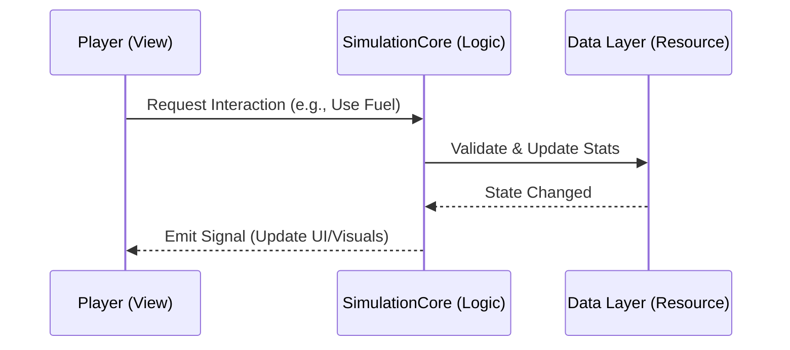

# :loop: Core Runtime Flow | [Home](../index.md)

The application boots from `Scenes/Main.tscn`, which immediately establishes the split between logic and **[visual rendering](../rendering/terrain3d_rendering.md)**.

---

## 🏗️ Simulation Sequence

!!! abstract "Boot Sequence"
    Open Farm initializes logic before visuals to ensure the world state is ready before the first frame is rendered.

1. **`GameManager` Load**: Reads the local configuration or save file.
2. **`SimulationCore` Start**: Boots the `EntityManager` and `TimeManager`.
3. **World Stream**: The `MapManager` scans for nearby vehicles and creates 3D nodes incrementally.

---

## :gear: Headless Logic Layer

The logic layer exists primarily in **`SimulationCore.gd`** and its associated Autoloads.

!!! gear "Authoritative Signal Bus"
    All logical state changes (time passing, fuel consumption, item picking) occur here first. Only after the logic confirms the change is a signal emitted to the View layer.

- **`TimeManager`**: Tracks seconds, minutes, and days. Emits `minute_passed` for consumers like `DayNightController`.
- **`EntityManager`**: The registry for every vehicle and player. It stores the `VehicleData` resources that survive even if the 3D vehicle is deleted to save memory.

---

## :eye: Visual Representation Layer

The visual layer is the "dumb" presentation of the simulation.

!!! success "View Layer decoupling"
    View scripts (like `Vehicle3D` or `Player`) should ideally never hold authoritative data. They are puppets that pull from the logic layer.

- **`Vehicle3D`**: Implements the GEVP physics based on the `VehicleData` stats.
- **`Player`**: Handles camera and movement basis relative to the `SimulationCore` stats (like stamina).

---

## :file_folder: Data Pipeline Flow

