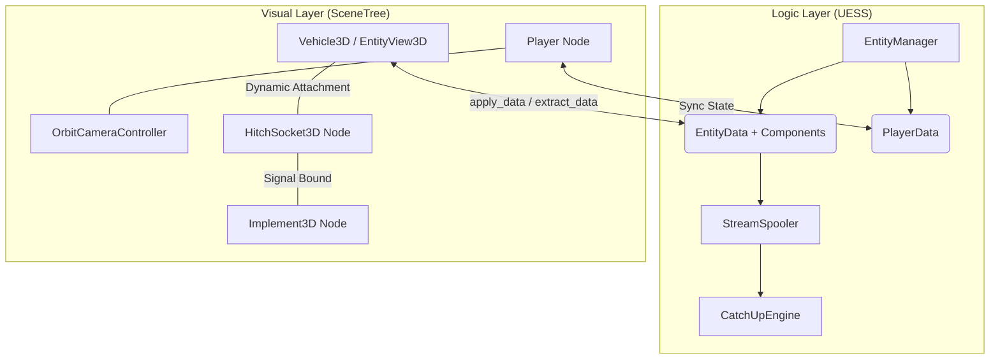

# :map: Architecture Overview | [Home](../index.md)

This project follows a strict **Logic-Visual Separation** (also known as Data-View Separation) powered by the **Universal Entity Streaming System (UESS)**.

!!! abstract "Core Philosophy"
    The project is split into two distinct execution layers to ensure simulation results are independent of 3D rendering and player proximity.

---

##  Logic vs. Visual Layers

### 1. The Logic Layer (UESS)
- **Location:** `Scripts/simulation/` and `Scripts/streaming/`.
- **Purpose:** Authoritative state management and headless simulation.
- **Components:**
    - `EntityManager`: Tracks the lifecycle of all entities via spatial hash chunking and streaming groups.
    - `EntityData`: A pure `RefCounted` object holding `runtime_id`, `definition_id`, and a dictionary of typed Components (`VehicleComponent`, `TransformComponent`, etc.).
    - `PlayerData`: Persistent player stats and world location.
    - `CatchUpEngine`: Processes elapsed time on entities during spool wakeup.
    - `StreamSpooler`: Time-sliced queue processor that creates/destroys 3D Nodes with microsecond budgets.

!!! success "Performance Benefit"
    We can simulate time passing for thousands of entities without needing them to be rendered or have 3D nodes in the SceneTree.

### 2. The Visual Layer (SceneTree)
- **Location:** `Scenes/` and `Scripts/views/`, `Scripts/vehicles/`.
- **Purpose:** User interaction, physics processing (GEVP), and rendering.
- **Components:**
    - `EntityView3D`: Base "puppet" class for all streamed 3D representations.
    - `Vehicle3D`: Inherits from `Vehicle` (GEVP) → `EntityView3D`. Handles driving input, camera, and syncs `VehicleComponent` data.
    - `Implement3D`: Inherits from `EntityView3D`. Handles standardized towing/tool states.
    - `HitchSocket3D`: Defines structural attachment rules and manages `StreamingGroup` assignments.

---

## :tractor: Vehicle Architecture

Vehicles are the most complex entities. Their lifecycle is fully managed by the UESS:
- **Data-Driven Definitions:** Vehicles are defined in JSON files (`Data/Entities/truck.json`) mapping to Components and a `view_scene`.
- **Streaming:** `StreamSpooler` instantiates vehicle scenes when their chunk becomes active and destroys them when they leave.
- **Persistence:** `apply_data()` reads `VehicleComponent` fuel/engine state on spawn. `extract_data()` writes the final physics state back before despawn.
- **Deterministic State:** Steering angles, wheel positions, and fuel levels survive streaming cycles.
- **Component-Based Implements:** Vehicle connectivity leverages `HitchSocket3D` components interacting with `Implement3D`, using streaming groups to keep connected chains loaded.

!!! info "Further Reading"
    For more details see: **[Vehicle Physics](../systems/vehicles.md)** and **[UESS Architecture](uess_architecture.md)**.

---

## :video_camera: Camera Architecture

The camera system is centralized through **OrbitCameraController.gd** to ensure DRY code.

- **Unified Logic:** Both Player and Vehicle use the same orbit and smoothing logic.
- **Distinct Modes:** Toggleable "Auto-Center" (GTA-style) for vehicles vs. "Movement-Basis" for on-foot players.

!!! info "Further Reading"
    For more details see: **[Camera System](../systems/camera.md)**.

---

## :gear: Data Pipeline

1. **Spawn:** `EntityRegistry` creates an `EntityData` from a JSON definition. `EntityManager` registers it and assigns a chunk.
2. **Stream:** `StreamSpooler` detects the entity in an active chunk, runs `CatchUpEngine`, instantiates the `view_scene`.
3. **Sync:** `EntityView3D.apply_data()` sets initial position/state. `_physics_process` continuously syncs transforms back.
4. **Despool:** When the chunk deactivates, `extract_data()` saves the final state, the 3D Node is destroyed.
5. **Persist:** `EntityData` components can be serialized to JSON for save/load (Phase 7).
