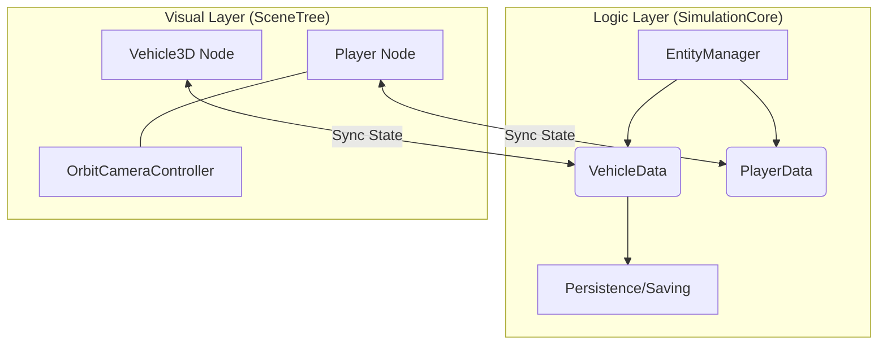

# :map: Architecture Overview | [Home](../index.md)

This project follows a strict **Logic-Visual Separation** (also known as Data-View Separation) to support large-scale simulation, persistence, and decoupling of concerns.

!!! abstract "Core Philosophy"
    The project is split into two distinct execution layers to ensure simulation results are independent of 3D rendering and player proximity.

---

## 🏛️ Logic vs. Visual Layers

### 1. The Logic Phase (SimulationCore)
- **Location:** `Singletons/SimulationCore.gd` and `Scripts/simulation/`.
- **Purpose:** Authoritative state management and headless simulation.
- **Components:**
    - `EntityManager`: Tracks the lifecycle of all entities (Players, Vehicles).
    - `VehicleData`: A pure `Resource` containing stats (fuel, maintenance) and world transform (pos/yaw).
    - `PlayerData`: Persistent player stats and world location.

!!! success "Performance Benefit"
    We can run the simulation for 100+ vehicles without needing them to be rendered or even have 3D nodes in the SceneTree.

### 2. The Visual Phase (SceneTree)
- **Location:** `Scenes/` and `Scripts/`.
- **Purpose:** User interaction, physics processing (GEVP), and rendering.
- **Components:**
    - `Vehicle3D`: The physical "puppet" that handles 3D interactions.
    - `Player`: User-controlled controller using `OrbitCameraController`.

---

## :tractor: Vehicle Architecture

Vehicles are the most complex entities in the project. Their lifecycle is split:
- **Persistence:** All steering angles, facing directions, and fuel levels are synced from `Vehicle3D` to `VehicleData` every frame.
- **Deterministic State:** When a player exits, the logic layer keeps the last known steering and position. This allows for realistic features like "leaving the wheels turned" after parking.

!!! info "Further Reading"
    For more details see: **[Vehicle Physics](../systems/vehicles.md)**.

---

## :video_camera: Camera Architecture

The camera system is centralized through **`OrbitCameraController.gd`** to ensure DRY code.
- **Unified Logic:** Both Player and Vehicle use the same orbit and smoothing logic.
- **Distinct Modes:** Toggleable "Auto-Center" (GTA-style) for vehicles vs. "Movement-Basis" for on-foot players.

!!! info "Further Reading"
    For more details see: **[Camera System](../systems/camera.md)**.

---

## :gear: Data Pipeline

1. **Input:** Player interacts with a 3D Node (`Vehicle3D`).
2. **Execution:** `Vehicle3D` processes physics and inputs.
3. **Publish:** `Vehicle3D` pushes its internal state (velocity, angle) to `EntityManager`.
4. **Simulation:** `EntityManager` updates the authoritative `VehicleData`.
5. **Persistence:** `VehicleData` can be saved to disk at any time as a `.tres` file.
