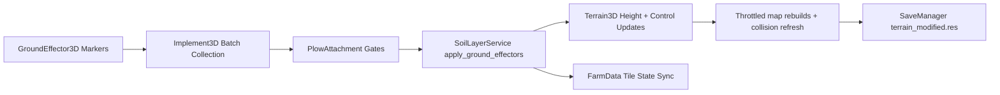

# Ground Effectors and Plowing | [Home](../index.md)

This page is the single source of truth for terrain deformation driven by implements (plow teeth, ridgers, and future soil tools).

---

## Scope

This document defines:

- How ground effectors are authored in scenes.
- How runtime batching, interpolation, and terrain writes work.
- How collision and map rebuild throttling are handled.
- How terrain changes are persisted in save slots.
- How to add more teeth safely and predictably.

If another doc conflicts with this page, this page wins.

---

## Runtime Architecture

### Core Files

- Scripts/vehicles/GroundEffector3D.gd
- Scripts/vehicles/Implement3D.gd
- Scripts/vehicles/Attachments/PlowAttachment.gd
- Scripts/farm/SoilLayerService.gd
- Scripts/vehicles/HitchSocket3D.gd
- Singletons/SaveManager.gd
- Scripts/core/MapManager.gd
- Scenes/Vehicles/Attachments/PlowAttachment.tscn

---

## GroundEffector3D Contract

`GroundEffector3D` is a Marker3D that serializes a single terrain instruction.

### Exposed Properties

| Property | Type | Meaning |
| --- | --- | --- |
| `effect_radius` | float | Stamp radius in meters. |
| `target_depth_offset` | float | Height target control. For `ADD`, negative values carve, positive values raise. |
| `blend_mode` | enum | `ADD`, `SUBTRACT`, or `REPLACE_EXACT`. |
| `soil_state_output` | enum int | Logical farm state written for affected grid cells. |
| `is_engaged` | bool | Runtime on/off flag for this tooth. |
| `engagement_depth_margin` | float | Extra tolerance above sampled terrain before treated as disengaged. |

### Blend Mode Semantics

| Mode | Result |
| --- | --- |
| `ADD` | `target = baseline_height + target_depth_offset` |
| `SUBTRACT` | `target = baseline_height - abs(target_depth_offset)` |
| `REPLACE_EXACT` | `target = target_depth_offset` in world Y |

Important rule: effector Y only controls engagement checks. It does not become the carve baseline.

---

## End-to-End Plow Flow

1. `PlowAttachment` runs only when lowered and active.
2. Movement and ground-contact gates are applied.
3. `Implement3D.collect_ground_effector_batch()` emits only effectors that are engaged and moved enough since last emit.
4. `SoilLayerService.apply_ground_effectors()` interpolates from previous to current positions using `ground_effect_segment_length_meters`.
5. Each segment point performs circular stamps.
6. Terrain height and control pixels are written.
7. Logical tile state is synchronized through `FarmData` updates.
8. Height/control map rebuilds are coalesced and flushed by interval.
9. Terrain collision updates are decoupled and distance-throttled.

---

## Adding More Teeth to the Plow

Use this exact workflow in Scenes/Vehicles/Attachments/PlowAttachment.tscn.

1. Create a Marker3D under the plow root.
2. Attach Scripts/vehicles/GroundEffector3D.gd.
3. Position it where the tooth contacts terrain.
4. Set properties for the behavior you want.

### Recommended Tooth Patterns

Cut tooth:

- `blend_mode = ADD`
- `target_depth_offset = -0.10` to `-0.20`
- `effect_radius = 0.12` to `0.22`
- `soil_state_output = PLOWED`

Ridge tooth:

- `blend_mode = ADD`
- `target_depth_offset = 0.05` to `0.12`
- `effect_radius = 0.12` to `0.22`
- `soil_state_output = PLOWED`

Exact leveling tooth:

- `blend_mode = REPLACE_EXACT`
- `target_depth_offset = desired_world_y`

### Placement Rules

- Keep teeth as direct or nested children of the implement scene root.
- Mirror left and right teeth for balanced pull forces.
- Keep tooth spacing near the visual blade spacing.
- Prefer several small radius teeth over one very large radius for stable detail.

### Runtime Toggle Rules

- Toggle individual teeth by setting `is_engaged`.
- Engagement can be dynamic per tooth at runtime.
- Disabled teeth are skipped cleanly by batch collection.

---

## Ground Contact and Gates

`PlowAttachment` applies deformation only when:

- Implement is lowered.
- PTO is active.
- Vehicle speed exceeds `min_apply_speed_sq`.
- Ground contact passes either overlap checks or terrain-height probe fallback.

Ground probe tuning:

- `ground_contact_probe_margin` controls tolerance above terrain.
- `ground_contact_probe_depth` controls tolerance below terrain.

---

## Teeth Collision Region Behavior

The `TeethCollisionRegion` Area3D is managed intentionally:

- Active when not plowing (raised or inactive).
- Disabled when lowered and actively plowing.

This prevents terrain-collision fighting during deformation while preserving non-plowing interactions.

---

## X-Axis Rigidity and Anti-Sway

`HitchSocket3D` exposes dedicated lateral stabilization:

- `x_axis_position_stiffness`
- `x_axis_velocity_damping`
- `max_x_axis_stabilization_g`
- `x_axis_yaw_damping`
- `max_x_axis_yaw_stabilization_torque`

Current tractor defaults are overridden in Scenes/Vehicles/Truck.tscn for a tighter, less swingy plow response.

If you tune further, increase damping before increasing stiffness to avoid oscillation.

---

## Performance Model

`SoilLayerService` is optimized for sustained plowing:

- Movement-threshold batching in `Implement3D`.
- Path interpolation at `ground_effect_segment_length_meters`.
- Deferred map rebuild flush in `_process`.
- Coalesced map updates by `map_rebuild_interval_seconds`.
- Edited-region marking to avoid broad rebuild churn.
- Collision updates decoupled from every stamp via `collision_rebuild_distance_meters`.

Primary tuning knobs:

- `effector_move_threshold_meters` in `Implement3D`.
- `ground_effect_segment_length_meters` in `SoilLayerService`.
- `map_rebuild_interval_seconds` in `SoilLayerService`.
- `collision_rebuild_distance_meters` in `SoilLayerService`.

---

## Save and Load Behavior

Terrain deformation is persisted per slot.

- Save path: slot temporary folder writes `terrain_modified.res`.
- Load path: `terrain_modified.res` is restored before final world rebuild.
- Fallback path: Terrain3D directory save/load is used when needed.
- New game safety: `MapManager` duplicates terrain data at runtime to protect pristine map assets.

This guarantees slot-isolated terrain state without mutating source map resources.

---

## Extension Guide for New Implements

To add another soil tool (for example seeder rows or ridger bars):

1. Inherit from `Implement3D`.
2. Add one or more `GroundEffector3D` markers in the scene.
3. Reuse `collect_ground_effector_batch()` and submit to `SoilLayerService.apply_ground_effectors()`.
4. Gate by implement state and contact, similar to `PlowAttachment`.
5. Use per-tooth `soil_state_output` for desired logical transitions.

No new terrain pipeline is required.

---

## Validation Checklist

1. Lower and activate plow.
2. Drive forward and confirm continuous deformation with no large frame spikes.
3. Raise plow and confirm deformation stops.
4. Save slot, reload slot, confirm terrain modifications persist.
5. Start a new game and confirm pristine map remains untouched.
6. Add one new tooth marker and verify it contributes immediately.

---

## Troubleshooting

No deformation:

- Verify implement is lowered and active.
- Check tooth `is_engaged` values.
- Ensure speed is above `min_apply_speed_sq`.
- Confirm tooth markers are children in the implement scene and use `GroundEffector3D` script.

Too much FPS drop:

- Increase `map_rebuild_interval_seconds`.
- Increase `effector_move_threshold_meters`.
- Increase `ground_effect_segment_length_meters` moderately.
- Increase `collision_rebuild_distance_meters`.

Plow still swings laterally:

- Increase `x_axis_velocity_damping` first.
- Increase `x_axis_yaw_damping` second.
- Raise stiffness after damping if needed.
