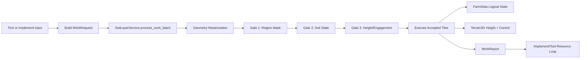

# Implements, Ground Arbitrator, and Plowing | [Home](../index.md)

This document is the authoritative source for all agricultural implement behavior in OpenAcre.

It covers:

- Work contracts (`WorkRequest`, `WorkReport`, operation taxonomy)
- Arbitrator execution pipeline (`SoilLayerService.process_work_batch`)
- Implement setup (scene, hitch, effectors, drag, gating)
- 3-point hitch rigidity and towing physics tuning
- Performance, save/load, debugging, and validation

If another document conflicts with this page, this page wins.

---

## 1. System Architecture

### Core runtime files

- `Scripts/farm/work/WorkOperationType.gd`
- `Scripts/farm/work/WorkRequest.gd`
- `Scripts/farm/work/WorkReport.gd`
- `Scripts/farm/SoilLayerService.gd`
- `Scripts/farm/FarmData.gd`
- `Scripts/vehicles/Implement3D.gd`
- `Scripts/vehicles/GroundEffector3D.gd`
- `Scripts/vehicles/HitchSocket3D.gd`
- `Scripts/vehicles/Attachments/PlowAttachment.gd`

---

## 2. Work Taxonomy and Data Contracts

### 2.1 WorkOperationType

`WorkOperationType.Value` currently defines:

- `TILLAGE`
- `SOWING`
- `APPLICATION`
- `HARVESTING`
- `CLEARING`

V1 production usage in runtime pipeline is `TILLAGE`, `SOWING`, `HARVESTING`.

### 2.2 WorkRequest

`WorkRequest` fields (canonical):

| Field | Purpose |
| --- | --- |
| `operation` | Operation enum value. |
| `geometry_type` | `POINT_RADIUS`, `LINE_SWEEP`, `QUAD_SWEEP`. |
| `point_center`, `line_start`, `line_end`, `quad_points_xz`, `radius_meters` | Geometry payload. |
| `payload` | Operation-specific metadata (seed ID, depth offset, blend mode, yield base, etc.). |
| `engagement_height`, `engagement_margin` | Height gate metadata. |
| `max_budget` | Maximum accepted tiles for commit safety. |
| `source_tag` | Tool/implement origin marker for logs/debug. |

### 2.3 WorkReport

`WorkReport` output fields:

| Field | Purpose |
| --- | --- |
| `requested_area` | Requested area in m2. |
| `successful_area` | Accepted and committed area in m2. |
| `rejected_area` | Rejected area in m2. |
| `yield_generated` | Commodity dictionary, for example `{"item.wheat": 14.5}`. |
| `rejected_unfarmable` | Gate-1 rejections. |
| `rejected_wrong_state` | Gate-2 rejections. |
| `rejected_height` | Gate-3 rejections. |
| `rejected_budget` | Budget-limit rejections. |

---

## 3. Arbitrator Pipeline (SoilLayerService)

### 3.1 Entry point

All world edits route through:

`process_work_batch(requests: Array, force_collision_rebuild_now: bool = false, collect_debug_tiles: bool = false) -> Array`

Legacy compatibility wrappers call into this:

- `plow_world(...)`
- `seed_world(...)`
- `harvest_world(...)`
- `apply_ground_effectors(...)` (legacy dictionary bridge)

### 3.2 Geometry rasterization rules

- Point/radius: center-distance inclusion.
- Line sweep: capsule test using point-to-segment distance.
- Quad sweep: polygon inclusion in XZ plane.

### 3.3 Center-point tile selection rule

Tile `(x, z)` is only selected when its center `(x + 0.5, z + 0.5)` lies inside the geometry test.

This prevents edge clipping artifacts and jagged partial-corner updates.

### 3.4 Deduplication

Tiles are deduplicated per request using dictionary-as-set semantics before validation.

This ensures overlapping geometry cannot multi-hit the same tile in one request pass.

### 3.5 Validation gates

Gates execute in this strict order:

1. Map mask (`FarmData.can_plow_at`) -> `rejected_unfarmable`
2. Soil state transition eligibility -> `rejected_wrong_state`
3. Height/engagement check -> `rejected_height`
4. Budget clamp (`max_budget`) -> `rejected_budget`

### 3.6 Execution rules

- `TILLAGE`: updates terrain and logical state (`soil_state_output`, depth/blend payload).
- `SOWING`: delegates to `FarmData.plant_crop(...)`, updates soil overlay.
- `HARVESTING`: delegates to `FarmData.harvest_crop(...)`, then computes maturity-scaled yield.

### 3.7 Harvest yield formula

For each harvested tile:

$$
growth\_ratio = clamp\left(\frac{now\_minutes - planted\_at\_minute}{growth\_minutes\_required}, 0, 1\right)
$$

$$
final\_yield = base\_tile\_yield \times growth\_ratio
$$

The final `yield_generated` dictionary is the sum of all accepted harvested tiles.

### 3.8 Deferred terrain updates

Terrain writes are coalesced through existing map update throttles. Collision rebuild remains distance-throttled.

---

## 4. Implement Runtime Model

`Implement3D` is the base class for all vehicle-mounted implements.

### 4.1 Capability and emission gates

Implemented as exported controls:

- `requires_pto`
- `requires_lowering`
- `min_work_speed`
- `max_work_speed`

`can_emit_work_requests(speed_mps)` is the shared gate for request generation.

### 4.2 Geometry emission modes

- Legacy/standard: per-effector line sweeps from `GroundEffector3D`
- Wide implements: span-quad sweep using `Effector_Left` and `Effector_Right` markers

### 4.3 GroundEffector3D contract

Each effector can emit a typed request via:

`to_work_request(operation, previous_position, payload, source_tag, max_budget)`

Key runtime properties:

- `effect_radius`
- `target_depth_offset`
- `blend_mode`
- `soil_state_output`
- `is_engaged`
- `engagement_depth_margin`

---

## 5. Hitch Physics Status

Current stable runtime uses the established hitch coupling model in `HitchSocket3D`.

- Drawbar and 3-point continue using the existing tuned PD-style coupling path.
- X-axis anti-sway controls remain available:
   - `x_axis_position_stiffness`
   - `x_axis_velocity_damping`
   - `max_x_axis_stabilization_g`
   - `x_axis_yaw_damping`
   - `max_x_axis_yaw_stabilization_torque`

Planned future work:

- Reintroduce stronger 3-point rigidity controls after profiling and playtesting.
- Reintroduce generalized implement drag once vehicle feel is revalidated.

---

## 6. How To Add a New Implement (Complete Setup)

This is the official setup checklist for new implements.

### Step 1: Scene setup

1. Create a new scene inheriting from an implement base scene or from a scene with `Implement3D` script.
2. Add a `HitchPoint` marker at the physical connection location.
3. Add collision and interaction geometry as needed.

### Step 2: Choose hitch type and behavior

In `Implement3D` exports:

1. Set `required_hitch_type` (`HITCH_3_POINT`, `HITCH_DRAWBAR`, `FRONT_LOADER`).
2. Set `required_power_kw`.
3. Configure gating (`requires_pto`, `requires_lowering`, speed window).

### Step 3: Add work geometry

Choose one:

1. Marker-based effectors:
   - Add one or more `GroundEffector3D` markers.
   - Set radius/depth/blend/state output.
2. Span quad mode:
   - Enable `use_span_quad_mode`.
   - Add `Effector_Left` and `Effector_Right` markers and bind paths.

### Step 4: Implement script logic

Subclass `Implement3D` (for example `PlowAttachment`) and:

1. Apply local operation gates (ground contact, minimum speed, etc.).
2. Generate requests via `collect_work_requests(...)`.
3. Submit to `SoilLayerService.process_work_batch(...)`.
4. Consume `WorkReport` for resource updates and user feedback.

### Step 5: Register in entity definitions

Create/update JSON in `Data/Entities/*.json`:

1. Set `id`.
2. Set `view_scene` to implement scene.
3. Add required components (`transform`, `container`, other custom components).

### Step 6: Spawn and verify

1. Spawn via map spawn table or developer console.
2. Attach to a compatible socket.
3. Validate lowering, PTO, drag, and report behavior.

---

## 7. Tool Integration

Hand tools (hoe/seed and future harvest tools) should construct point-radius `WorkRequest` packets and use `WorkReport` outcomes for:

- success/fail feedback
- stamina/resource consumption
- future UI notifications

The same gate logic applies to tools and implements through the arbitrator.

---

## 8. Save/Load and Runtime Safety

Terrain and soil behavior remains slot-safe:

- Runtime terrain data is isolated from pristine source data on new game.
- Save writes deformed terrain into slot runtime assets.
- Load restores runtime terrain before rebuild and streaming stabilization.

`MapManager` now attempts runtime isolation across both Terrain3D data and storage APIs.

---

## 9. Debugging and Observability

### 9.1 Work report summaries

`SimulationDebugOverlay` displays the latest work report summaries from `SoilLayerService.get_last_work_report_summaries()`.

### 9.2 Current rejection strategy

V1 uses summary counters, not per-tile log spam.

Plow attachment emits throttled starvation logs when entire passes are rejected.

---

## 10. Performance Controls

Primary controls:

- `effector_move_threshold_meters` (`Implement3D`)
- `ground_effect_segment_length_meters` (`SoilLayerService`)
- `map_rebuild_interval_seconds` (`SoilLayerService`)
- `collision_rebuild_distance_meters` (`SoilLayerService`)

Guideline: increase damping and thresholds before increasing brute-force stiffness.

---

## 11. Validation Checklist

### Functional

1. Tillage only affects farmable mask regions.
2. Sowing only succeeds on plowed tiles.
3. Harvest yield scales by maturity ratio.
4. Overlap passes do not multi-hit same tile per request.
5. Budget clamps accepted tiles correctly.

### Physics

1. 3-point hitch remains stable under acceleration/braking.
2. No NaN/explosion under hard-stop snag scenarios.

### Persistence

1. Save/load preserves terrain modifications.
2. New game does not mutate pristine terrain resources.

---

## 12. Troubleshooting

### No soil changes

1. Verify implement is lowered and PTO state satisfies gates.
2. Verify effector markers are using `GroundEffector3D`.
3. Check speed and contact gates.
4. Inspect debug overlay work summary for rejection reason distribution.

### Hitch oscillation

1. Increase `x_axis_velocity_damping` first.
2. Increase `x_axis_yaw_damping` second.
3. Increase `x_axis_position_stiffness` after damping is stable.
