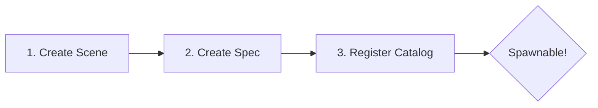

# :tractor: Vehicle Physics | [Home](../index.md)

Vehicles within the ecosystem utilize Godot Easy Vehicle Physics (GEVP) coupled with custom deterministic simulation systems (see **[Addon Patches](../dev/addon_patches.md)**).

!!! abstract "Architecture Pattern"
    This project strictly separates **Physical Rendering** (View) from **Authoritative State** (Logic).

---

## 🛠️ How to Set Up a New Vehicle

This project uses a rigorous data-driven architecture. Decoupling the **Identity** (Spec) from its **Instance** (Scene) allows for easy modding and variants.

### Step 1: Create the Scene (The Visuals)
1. Go to `Scene -> New Inherited Scene`.
2. Select `res://Scenes/Vehicles/Vehicle3D.tscn` as the base.
3. Save it as your new scene (e.g., `res://Scenes/Vehicles/MyCar.tscn`).
4. Drag your 3D `.glb` model into the scene.
5. In the Scene tree, assign the 4 `wheel_*_visual_path` properties to point to your new visual wheel meshes.

!!! failure "Scale Warning"
    **Do not scale the root `RigidBody3D` or the `RayCast3D` wheels**, as it will break the physics engine. Only scale visual nodes if necessary.

### Step 2: Create the Spec (The Data)
1. Right-click in your FileSystem -> `New -> Resource`.
2. Search for `VehicleSpec`. Save it in `res://Assets/Vehicles/Data/Vehicles/`.
3. In the Inspector, configure your **Spec ID** (snake_case) and drag and drop your **Vehicle Scene**.

### Step 3: Register It in the Catalog
1. Open `res://Assets/Vehicles/Data/Vehicles/VehicleCatalog_Default.tres`.
2. Expand the `Specs` array and drag your `MyCarSpec.tres` into a new slot.

---

## 🏎️ Steering Mechanics

The vehicle steering is designed for a **Realistic / Farming Simulator** feel.

!!! quote "Realistic Feel"
    Instead of arcade-style instant return, steering input rotates a hidden "target," and the wheels stay put after releasing the keys.

### Key Concepts:
- **Stay-Put Logic**: When you release A/D, the wheels stay at their current angle.
- **Caster Effect**: Natural self-centering forces straighten the wheels based on speed.
- **Sensitivity**: Controlled by `steering_sensitivity` in the inspector.

---

## 💾 State Persistence

The [Data-Visual Separation](../architecture/overview.md) ensures the vehicle state is preserved even when it is not being rendered.

### What is Persisted in `VehicleData`?

| Category | Property | Purpose |
| --- | --- | --- |
| **Locative** | `world_position`, `world_yaw` | World transform preservation. |
| **Mechanical** | `steering_input`, `speed_mps` | Persistent wheel angle and momentum. |
| **Simulation** | `fuel_level`, `maintenance` | Consumables and engine health. |
| **Logical** | `occupant_player_id` | Tracking who is currently driving. |

!!! success "Why it matters"
    If you park a tractor with the wheels turned, they will stay turned even after you leave and reload the game. Syncing happens **every frame** while active.
