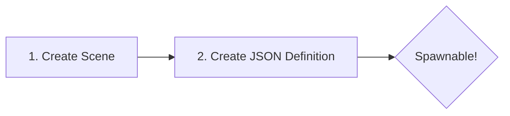

# :tractor: Vehicle Physics | [Home](../index.md)

Vehicles within the ecosystem utilize Godot Easy Vehicle Physics (GEVP) coupled with the **Universal Entity Streaming System (UESS)** (see **[Addon Patches](../dev/addon_patches.md)**).

!!! abstract "Architecture Pattern"
    This project strictly separates **Physical Rendering** (View) from **Authoritative State** (Logic) via `EntityView3D` → `Vehicle` (GEVP) → `Vehicle3D`.

---

## How to Add a New Vehicle

Vehicles are defined via JSON entity definitions. The creation workflow:



### Step 1: Create the Scene (The Visuals)
1. Go to `Scene → New Inherited Scene`.
2. Select `res://Scenes/Vehicles/Vehicle3D.tscn` as the base.
3. Save it as your new scene (e.g., `res://Scenes/Vehicles/MyCar.tscn`).
4. Drag your 3D `.glb` model into the scene.
5. In the Scene tree, assign the 4 `wheel_*_visual_path` properties to point to your visual wheel meshes.

!!! failure "Scale Warning"
    **Do not scale the root `RigidBody3D` or the `RayCast3D` wheels**, as it will break the physics engine. Only scale visual nodes if necessary.

### Step 2: Create the JSON Definition (The Data)
Create a new `.json` file in `Data/Entities/`:

```json
{
    "id": "vehicle.my_car",
    "view_scene": "res://Scenes/Vehicles/MyCar.tscn",
    "components": {
        "transform": {},
        "vehicle": {
            "fuel_level": 100.0,
            "max_fuel": 150.0,
            "engine_temp_celsius": 20.0
        },
        "seat": {}
    }
}
```

The `EntityRegistry` autoload will parse this on startup. Use `spawn vehicle.my_car` (or `spawn my_car`) in the developer console to test.

### Component-Based Hitch Architecture
Vehicles that support towing implements must use a component-based attachment system:
- **HitchSocket3D Component**: Attach a `Marker3D` with `HitchSocket3D.gd` anywhere on the vehicle (e.g., `AttachmentSockets/RearHitch`). The socket dictates structural physics joints and limits.
- **StreamingGroup Integration**: When an implement is attached, `HitchSocket3D` assigns both entities to the same `StreamingGroup`, ensuring the entire chain stays loaded across chunk boundaries.
- **Signal-Bound Teardowns**: Socket interactions use memory-safe signals (`signal.connect(_func.bind(socket))`).

!!! info "Implements Source of Truth"
    For full implement architecture and setup (work contracts, arbitrator flow, geometry, drag, hitch rigidity tuning, and complete onboarding), use [Implements, Ground Arbitrator, and Plowing](ground_effectors_and_plowing.md).

### Implement Quick Setup (Summary)
1. Build implement scene on top of `Implement3D`.
2. Set hitch/power/gating exports (`required_hitch_type`, PTO/lowering/speed gates).
3. Add `GroundEffector3D` markers or span quad markers.
4. Generate requests and process reports through `SoilLayerService.process_work_batch(...)`.
5. Validate with `SimulationDebugOverlay` work summary output.

---

## Steering Mechanics

The vehicle steering is designed for a **Realistic / Farming Simulator** feel.

!!! quote "Realistic Feel"
    Instead of arcade-style instant return, steering input rotates a hidden "target," and the wheels stay put after releasing the keys.

### Key Concepts:
- **Stay-Put Logic**: When you release A/D, the wheels stay at their current angle.
- **Caster Effect**: Natural self-centering forces straighten the wheels based on speed.
- **Sensitivity**: Controlled by `steering_sensitivity` in the inspector.

---

## State Persistence

The [UESS Architecture](../architecture/uess_architecture.md) ensures vehicle state is preserved even when the vehicle is not being rendered.

### What is Persisted in `VehicleComponent`?

| Category | Property | Purpose |
| --- | --- | --- |
| **Locative** | `world_position`, `world_rotation_radians` | World transform preservation (via `TransformComponent`). |
| **Mechanical** | `fuel_level`, `engine_temp_celsius` | Fuel and engine state (via `VehicleComponent`). |
| **Logical** | `is_occupied`, `occupant_id` | Tracking who is driving (via `SeatComponent`). |

!!! success "Why it matters"
    If you park a tractor with the wheels turned, they will stay turned even after you leave and the vehicle despools. Syncing happens via `extract_data()` before the 3D Node is destroyed.

### Spatial Hash Authority Rule (Critical)

`EntityView3D.extract_data()` must route transform writes through `EntityManager.update_entity_transform(runtime_id, pos, yaw)`.

- Why: direct mutation of `TransformComponent` bypasses chunk reassignment, leaving stale `chunk_id` ownership.
- Failure mode: StreamSpooler unloads the old chunk, sees stale membership, and despawns the still-driven vehicle.
- Enforced behavior: the manager is the single authority for both transform persistence and chunk membership updates.

---

## :satellite: Streaming, Despawn, and Far-Distance Safety

Vehicle spawning/despawning is managed by the `StreamSpooler` as part of the UESS.

### Core Behavior

- **Chunk-Based Loading**: Vehicles are loaded when their chunk enters the player's active radius (2-chunk default).
- **Time-Sliced Instantiation**: The `StreamSpooler` uses microsecond budgets (1.5ms load, 0.5ms unload) to prevent frame drops.
- **Catch-Up Engine**: Before spawning, `CatchUpEngine` processes any elapsed simulation time (e.g., fuel consumption while the vehicle was unloaded).
- **Streaming Groups**: Attachment chains (Tractor + Plow) share a `StreamingGroup` ID, preventing partial loading.
- **Active Convoy Immunity**: During unload queueing, `StreamSpooler` checks `PlayerData.active_vehicle_id` and preserves every entity in that same `StreamingGroup`.
- **Forced Eject Safety**: If a driven `Vehicle3D` must unload, spooler calls `vehicle.force_eject()` synchronously before `queue_free()`, so camera/control returns to the player first.
- **Despool Handshake**: Before destruction, `extract_data()` saves the exact physics state (position, rotation, fuel) back to the `EntityData`.
- **Teleport Safety**: Vehicle teleports call `extract_data()` immediately so long-distance moves cannot remain registered in stale chunks.

!!! warning "Ownership Requirement"
    Despawn/load safety only applies to UESS-owned entities. Vehicles instantiated directly as raw scenes are not managed by `EntityManager`/`StreamSpooler` lifecycle rules.

### Quick Validation Checklist

1. Use `spawn vehicle.truck` (or `spawn truck`) in the developer console and confirm the truck appears.
2. Enter the vehicle, drive across multiple chunk boundaries, and verify no despawn while occupied.
3. Attach an implement and drive near chunk edges; verify the full convoy remains loaded (no hitch break).
4. Teleport the driven vehicle far away (developer command) and verify it survives immediate chunk churn.
5. Intentionally delete or unload a driven vehicle and verify the player is force-ejected with camera restored.
6. Return to prior areas and confirm no duplicate vehicle respawn from stale chunk registration.

For terrain-side collision details, see [Terrain3D Rendering](../rendering/terrain3d_rendering.md).
